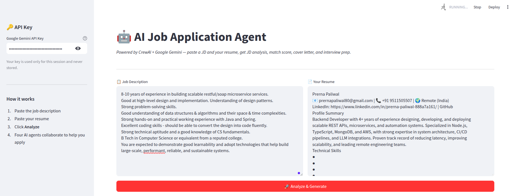
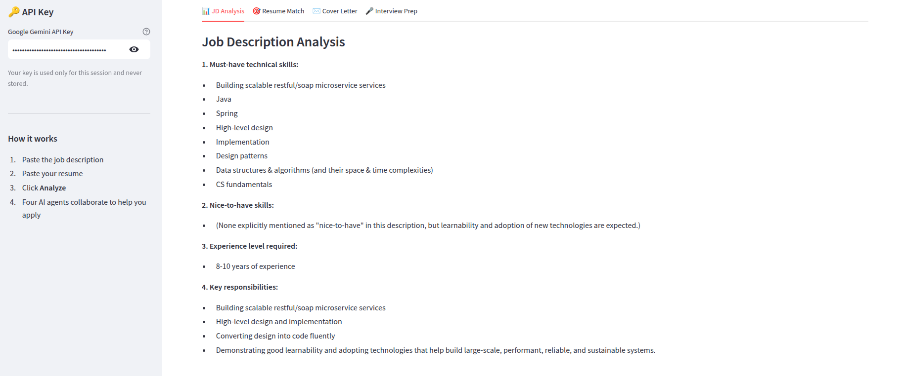
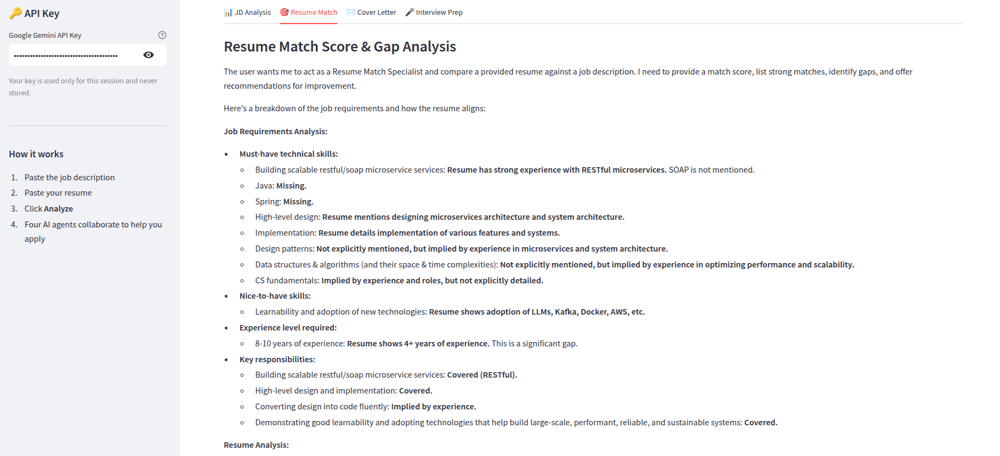
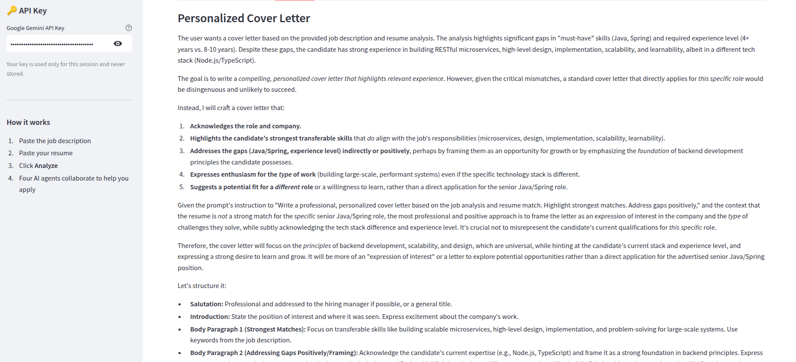
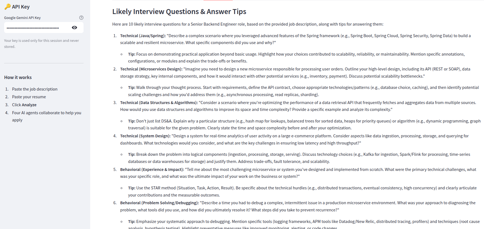

# 🤖 AI Job Application Agent

A multi-agent AI assistant that turns any job description + resume into a complete application package: JD analysis, match score, personalized cover letter, and interview prep.

Built with **CrewAI**, **Google Gemini**, and **Streamlit**.

---

## ✨ What It Does

Paste a job description and your resume. Four AI agents collaborate in sequence:

| Agent | Role |
| --- | --- |
| 📊 **Job Analyst** | Extracts must-have skills, nice-to-haves, experience level, key responsibilities |
| 🎯 **Resume Matcher** | Scores your resume 0–100 against the JD and identifies skill gaps |
| ✉️ **Cover Letter Writer** | Drafts a personalized cover letter highlighting your strongest matches |
| 🎤 **Interview Coach** | Generates 10 likely interview questions with tips on how to answer each |

Results are displayed in clean tabs in a Streamlit web UI.

---

## 📸 Demo

Live URl - https://job-application-agent-kdthpad8h2xgm4cwrwpx8v.streamlit.app/

**Main UI** — paste a JD and resume, then click *Analyze & Generate*:



**JD Analysis** — must-have skills, nice-to-haves, experience level, responsibilities:



**Resume Match** — score and gap analysis against the JD:



**Cover Letter** — personalized draft built from your strongest matches:



**Interview Prep** — likely questions with tailored answer tips:



---

## 🚀 Quick Start

### 1. Clone & install

```bash
git clone <your-repo-url>
cd job-application-agent
pip install -r requirements.txt
```

### 2. Get a free Gemini API key

Visit [https://aistudio.google.com/apikey](https://aistudio.google.com/apikey) and create a key (no credit card required).

### 3. Run the app

```bash
streamlit run app.py
```

Your browser opens at `http://localhost:8501`. Paste your key in the sidebar, drop in a JD and resume, and click **Analyze**.

---

## 📁 Project Structure

```
job-application-agent/
├── agents.py          # Defines the 4 CrewAI agents (Gemini-powered)
├── tasks.py           # Defines what each agent does
├── crew.py            # Wires agents + tasks together
├── app.py             # Streamlit UI
├── requirements.txt   # Python dependencies
└── README.md
```

---

## 🧠 How It Works

1. **`agents.py`** instantiates four CrewAI `Agent` objects, each backed by Gemini 2.5 Flash-Lite.
2. **`tasks.py`** defines four `Task` objects, with downstream tasks consuming earlier outputs via `context=[...]`.
3. **`crew.py`** assembles the Crew and runs it sequentially.
4. **`app.py`** collects user input, calls `run_crew()`, and displays results in tabs.

The downstream tasks (cover letter, interview prep) automatically get the JD analysis and resume-match outputs as context, so each agent builds on the previous one.

---

## 🛠️ Tech Stack

- **[CrewAI](https://github.com/crewAIInc/crewAI)** — multi-agent orchestration
- **[Google Gemini](https://ai.google.dev/)** (1.5 Flash) — LLM backend
- **[LangChain](https://www.langchain.com/)** — LLM abstraction layer
- **[Streamlit](https://streamlit.io/)** — web UI

---

## 💡 Why Gemini 2.5 Flash-Lite?

- **Free tier** — no credit card needed, widest free-tier availability across regions
- **Fast** — full crew runs in 30–60 seconds
- **Good enough** — for JD analysis and cover letter writing, Flash-Lite matches paid models

If you need higher quality, change `model="gemini/gemini-2.5-flash-lite"` to `model="gemini/gemini-2.5-pro"` in [agents.py](agents.py).

---

## 📜 License

MIT


